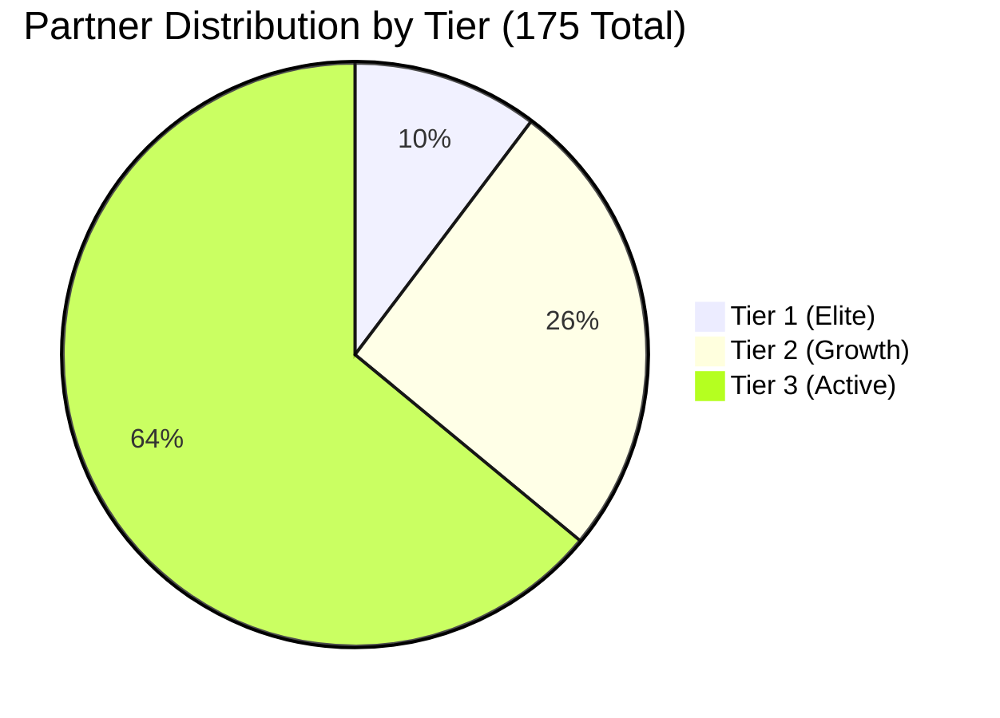

# Deterministic Synthetic Data Generation Specification

**Project:** Channel Partner Intelligence  
**Phase:** Phase 2B — Database Implementation & Deterministic Dataset  
**Random Seed:** `42` (Fixed bit-level reproducibility)

---

## 1. Executive Summary & Disclaimer

> [!IMPORTANT]
> **Synthetic Demo Data Notice**: All data generated by the synthetic generator—including partner names, contact numbers, email addresses, transaction values, commissions, and project inventories—is entirely synthetic and fabricated for simulation, architectural evaluation, and demonstration purposes.
>
> In particular, the **2.0% base commission assumption** is a synthetic modelling assumption and does NOT represent Hariwishwa's actual commercial policy, partner agreement structures, or legal terms.

---

## 2. Dataset Composition & Entity Counts

When seeded with `SEED = 42`, the generator produces the exact canonical benchmark dataset:

| Entity / Dimension | Target Specification | Generated Count (Seed 42) | Status |
| :--- | :--- | :--- | :--- |
| **Projects** | 5 | **5** | Pass |
| **Salespeople** | 10 | **10** | Pass |
| **Channel Partners** | 175 | **175** | Pass |
| ↳ *Tier 1 (Elite)* | 18 | **18** | Pass |
| ↳ *Tier 2 (Growth)* | 45 | **45** | Pass |
| ↳ *Tier 3 (Active)* | 112 | **112** | Pass |
| **Leads** | 3,800 – 4,200 | **4,020** | Pass |
| ↳ *Valid Leads* | — | **3,908** (97.2%) | Pass |
| ↳ *Qualified Leads (`qualified_at IS NOT NULL`)* | — | **2,891** (73.98% qualification) | Pass |
| **Site Visits** | 1,800 – 2,200 | **2,010** | Pass |
| ↳ *Completed Site Visits* | — | **1,743** (86.72% completion) | Pass |
| ↳ *Unique Visited Leads* | — | **1,472** | Pass |
| **Bookings** | 400 – 500 Confirmed | **483** total records | Pass |
| ↳ *Confirmed Bookings* | 400 – 500 | **454** (94.0%) | Pass |
| ↳ *Visited Leads Confirmed Bookings* | — | **440** (96.9%) | Pass |
| ↳ *Direct Confirmed Bookings (No Site Visit)* | — | **14** (3.1%) | Pass |
| ↳ *Cancelled Booking Records* | — | **29** (Historical audit) | Pass |
| **Partner Activities** | Sufficient for activity feed | **6,228** | Pass |

---

## 3. Partner Archetypes & Behavioral Profiles

Channel partners are synthesized with distinct behavioral patterns across 10 distinct archetypes:



### Archetype Taxonomy

1. **`elite_core` (Tier 1 - 10 partners)**:
   - High volume (46–54 leads/year)
   - Exceptional site visit booking conversion (~52%)
   - Frequent high-value transactions in luxury/core residential assets.

2. **`high_volume_moderate_conversion` (Tier 1 - 5 partners)**:
   - High lead volume (40–48 leads/year)
   - Moderate visit-to-booking conversion (~42%)
   - Wide customer demographic reach.

3. **`boutique_luxury` (Tier 1 - 3 partners)**:
   - Selective, focused lead volume (20–26 leads/year)
   - Premium average ticket size (>₹1.2 Cr+)
   - High customer qualification and conversion.

4. **`emerging_growth` (Tier 2 - 12 partners)**:
   - Fast-growing activity skewed toward H2
   - Strong momentum with high qualification rates.

5. **`moderate_steady` (Tier 2 - 15 partners)**:
   - Consistent monthly lead velocity (18–24 leads/year)
   - Reliable site visit attendance and deal closure.

6. **`high_volume_low_conversion` (Tier 2 - 10 partners)**:
   - Substantial lead generation (26–34 leads/year)
   - Lower qualification rate, requiring qualification follow-ups.

7. **`declining_at_risk` (Tier 2 - 8 partners)**:
   - Front-loaded activity in Q1/Q2, transitioning to dormancy in H2
   - Intentionally synthesized for future churn/intervention testing.

8. **`broad_active` (Tier 3 - 80 partners)**:
   - Standard broker network (22–28 leads/year)
   - Solid coverage across affordable and mid-segment projects.

9. **`infrequent_sporadic` (Tier 3 - 20 partners)**:
   - Sporadic deal flow (3–7 leads/year)
   - High responsiveness to project launches.

10. **`dormant` (Tier 3 - 12 partners)**:
    - Inactive accounts (`active = False` for 6 partners, 0 trailing activity)
    - Zero active leads or bookings, supporting dormant partner filtering.

---

## 4. Lifecycle & Semantics Enforcement

### 4.1 Milestone Qualification Retention
- Qualification is recorded via `qualified_at`.
- If a qualified lead subsequently drops out (`status = "Lost"`), the `qualified_at` timestamp is **strictly retained** (1,155 leads in the canonical dataset). This ensures historical cohort metrics remain accurate.

### 4.2 Direct Bookings vs. Site Visit Bookings
- **Direct Bookings**: 14 confirmed bookings occur without a preceding completed site visit (e.g. NRI buyers, repeat investors).
- **Visit $\rightarrow$ Booking Isolation**:
  $$\text{Visit to Booking Rate} = \frac{440 \text{ visited confirmed bookings}}{1,472 \text{ unique visited leads}} = 29.89\%$$
  Direct bookings are cleanly excluded from the numerator and denominator of this metric.

### 4.3 Active Booking Invariant
- A partial unique index on SQLite enforces at most 1 active booking (`Initiated` or `Confirmed`) per lead.
- Historical terminal records (`Cancelled`, `Completed`) remain queryable for lifecycle audit trails.

---

## 5. Seed Command & CLI Usage

To seed or reset the database:

```bash
# Seed default deterministic dataset (SEED=42)
python -m app.cli seed-db --seed 42

# Validate data integrity & funnel rules
python -m app.cli validate-db

# Clean reset and re-seed
python -m app.cli reset-db --seed 42
```
