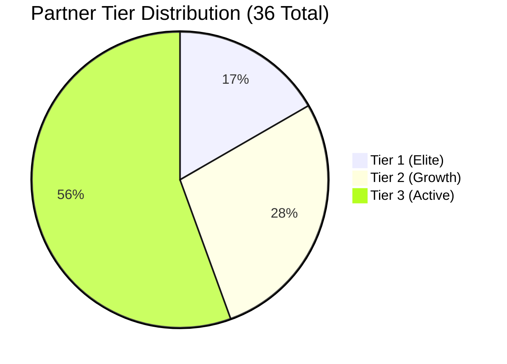

# Deterministic Synthetic Data Generation Specification (Phase 2D Harivishva Demo)

**Project:** Channel Partner Intelligence  
**Phase:** Phase 2D — Harivishva Demo Personalization  
**Random Seed:** `42` (Fixed bit-level reproducibility)  
**Geographic Focus:** Tathawade, Pune  

---

## 1. Executive Summary & Synthetic Data Notice

> [!IMPORTANT]
> **Demo Environment · Synthetic Data Notice**:
> All records generated by this synthetic data engine—including partner names, contact numbers, email addresses, transaction values, commissions, and project units—are **100% synthetic** and mathematically modeled for simulation, architectural evaluation, and executive demonstration purposes.
>
> Never interpret these records as actual Harivishva sales figures, real channel partner lists, actual conversion ratios, or legally binding commercial commission terms.
>
> In particular, the **2.0% base commission assumption** is a synthetic modeling parameter and does NOT represent Harivishva's actual commercial policy or contractual agreements.

---

## 2. Harivishva Demo Portfolio & Entity Scale

The synthetic generator produces a focused real estate operating profile designed specifically for Harivishva's Tathawade portfolio across two project families (Skyfinia and Infinia):

### 2.1 Project Universe (4 Records across 2 Families)

| Project Family | Phase | Code | Target Units | Base Price (INR) | Inventory Status |
| :--- | :--- | :--- | :--- | :--- | :--- |
| **Skyfinia** | Skyfinia Phase 1 | `PRJ-SKY-P1` | 320 units | ₹88,00,000 | Active |
| **Skyfinia** | Skyfinia Phase 2 | `PRJ-SKY-P2` | 280 units | ₹95,00,000 | Active |
| **Infinia** | Infinia Phase 1 | `PRJ-INF-P1` | 350 units | ₹82,00,000 | Active |
| **Infinia** | Infinia Phase 2 | `PRJ-INF-P2` | 300 units | ₹89,00,000 | Active |

All projects are situated in **Tathawade, Pune** with target configurations (2 BHK Smart, 2 BHK Premium, 3 BHK Luxury, 3 BHK Sky Villa).

---

### 2.2 Authoritative Sales / Relationship Managers (5 Records)

The demo environment features exactly 5 authoritative Harivishva relationship managers:
1. **Rohit Deshmukh** (`rohit.deshmukh@harivishva.com`)
2. **Sneha Kulkarni** (`sneha.kulkarni@harivishva.com`)
3. **Amit Patil** (`amit.patil@harivishva.com`)
4. **Priya Joshi** (`priya.joshi@harivishva.com`)
5. **Rahul Shinde** (`rahul.shinde@harivishva.com`)

---

### 2.3 Entity Counts & Canonical Seed 42 Benchmark

When initialized with `SEED = 42`, the generator yields the exact canonical dataset:

| Entity / Dimension | Target Specification | Generated Count (Seed 42) | Status |
| :--- | :--- | :--- | :--- |
| **Projects** | 4 (2 Families) | **4** | Pass |
| **Sales / Relationship Managers** | 5 | **5** (`@harivishva.com`) | Pass |
| **Channel Partners** | 36 (30–40 range) | **36** | Pass |
| ↳ *Tier 1 (Elite)* | 6 | **6** (16.7%) | Pass |
| ↳ *Tier 2 (Growth)* | 10 | **10** (27.8%) | Pass |
| ↳ *Tier 3 (Active)* | 20 | **20** (55.6%) | Pass |
| **Leads** | 1,200 – 1,500 | **1,262** total records | Pass |
| ↳ *Valid Leads (`status != 'Invalid'`)* | — | **1,238** (98.1%) | Pass |
| ↳ *Qualified Leads (`qualified_at IS NOT NULL`)* | — | **956** (77.22% qualification rate) | Pass |
| **Site Visits** | 500 – 800 | **728** total scheduled | Pass |
| ↳ *Completed Site Visits* | 600 – 750 | **625** (85.85% completion rate) | Pass |
| ↳ *Unique Visited Leads* | — | **510** (53.35% qualified $\rightarrow$ visit rate) | Pass |
| **Bookings** | 100 – 160 Confirmed | **174** total booking records | Pass |
| ↳ *Confirmed / Completed Bookings* | 100 – 160 | **156** | Pass |
| ↳ *Visited Leads Confirmed Bookings* | — | **151** (29.61% visit $\rightarrow$ booking rate) | Pass |
| ↳ *Direct Confirmed Bookings (No Site Visit)* | — | **5** (3.2% of confirmed) | Pass |
| ↳ *Initiated Bookings (In Pipeline)* | — | **6** | Pass |
| ↳ *Cancelled Booking Records* | — | **12** (Historical audit trail) | Pass |
| **Partner Activities** | Sufficient audit volume | **2,037** activity logs | Pass |

---

## 3. Partner Archetypes & Project Affinity Patterns

### 3.1 Project Affinity Specialization
Channel partners are assigned realistic project affinity profiles:
1. **Skyfinia Specialists**: ~85% of leads and bookings directed toward Skyfinia Phase 1 & Phase 2.
2. **Infinia Specialists**: ~85% of leads and bookings directed toward Infinia Phase 1 & Phase 2.
3. **Balanced Portfolio**: Balanced distribution across both Skyfinia and Infinia.

This creates meaningful, project-specific analytics on the **Project Booking Contribution** chart in Partner Detail.

### 3.2 Partner Archetype Taxonomy



1. **`elite_core` (Tier 1 - 3 partners)**:
   - High volume (46–54 leads/year)
   - Exceptional site visit booking conversion (~52%)
   - High cross-project closing capability across Skyfinia and Infinia.

2. **`high_volume_moderate_conversion` (Tier 1 - 2 partners)**:
   - High lead volume (40–48 leads/year)
   - Broad reach in Tathawade/Wakad/Hinjawadi micro-markets.

3. **`boutique_luxury` (Tier 1 - 1 partner)**:
   - Selective volume (20–26 leads/year)
   - High ticket sizes in Skyfinia 3 BHK Sky Villas.

4. **`emerging_growth` (Tier 2 - 3 partners)**:
   - Fast-growing activity skewed toward H2 2026.
   - High momentum with strong qualification rates.

5. **`moderate_steady` (Tier 2 - 3 partners)**:
   - Consistent monthly deal flow (18–24 leads/year) with reliable visit attendance.

6. **`high_volume_low_conversion` (Tier 2 - 2 partners)**:
   - High lead volume (26–34 leads/year) with lower visit conversion.

7. **`declining_at_risk` (Tier 2 - 2 partners)**:
   - Front-loaded activity in Q1/Q2, tapering off in Q3/Q4 for churn detection modeling.

8. **`broad_active` (Tier 3 - 12 partners)**:
   - Standard broker network in Pune west micro-markets (Tathawade, Ravet, Punawale).

9. **`infrequent_sporadic` (Tier 3 - 5 partners)**:
   - Sporadic deal flow (3–7 leads/year) triggered during project phase launches.

10. **`dormant` (Tier 3 - 3 partners)**:
    - Inactive partner accounts (`active = False` for 2 partners, 0 trailing 90-day activity).

---

## 4. Lifecycle & Semantics Enforcement

### 4.1 Strict 2026 Timeline Boundary
- Canonical window: `2026-01-01 00:00:00 UTC` to `2026-12-31 23:59:59 UTC`.
- Zero events or audit records exist in 2027 or beyond.

### 4.2 Milestone Qualification Retention
- `qualified_at` is permanently retained for all leads that achieved qualification, even if the lead later transitions to `Lost`.

### 4.3 Direct Booking Isolation
- Direct bookings (5 units in Seed 42) are cleanly excluded from the **Visit $\rightarrow$ Booking Rate**:
  $$\text{Visit to Booking Rate} = \frac{151 \text{ visited confirmed bookings}}{510 \text{ unique visited leads}} = 29.61\%$$

### 4.4 Active Booking Invariant
- A SQLite partial unique index enforces at most 1 active booking (`Initiated` or `Confirmed`) per lead.

### 4.5 Synthetic Project Pricing Rule & Floor Invariant
- Every booking agreement value is derived deterministically from the project's base starting price, unit configuration premium, and unit variance tier:
  $$\text{Booking Value} = \text{RoundToLakh}(\text{Starting Price} \times (1 + \text{Config Premium}) + \text{Variance Add-on})$$
- **Invariant**: $\text{Booking Value} \ge \text{Project Starting Price}$ for 100% of generated records.
  - Skyfinia Phase 1: $\ge ₹88.0\text{ Lakh}$
  - Skyfinia Phase 2: $\ge ₹95.0\text{ Lakh}$
  - Infinia Phase 1: $\ge ₹82.0\text{ Lakh}$
  - Infinia Phase 2: $\ge ₹89.0\text{ Lakh}$

---

## 5. Seed Command & CLI Usage

```bash
# Seed deterministic Harivishva demo dataset (SEED=42)
python -m app.cli seed-db --seed 42

# Run comprehensive data integrity & domain validation suite
python -m app.cli validate-db

# Clean reset and re-seed
python -m app.cli reset-db --seed 42
```
